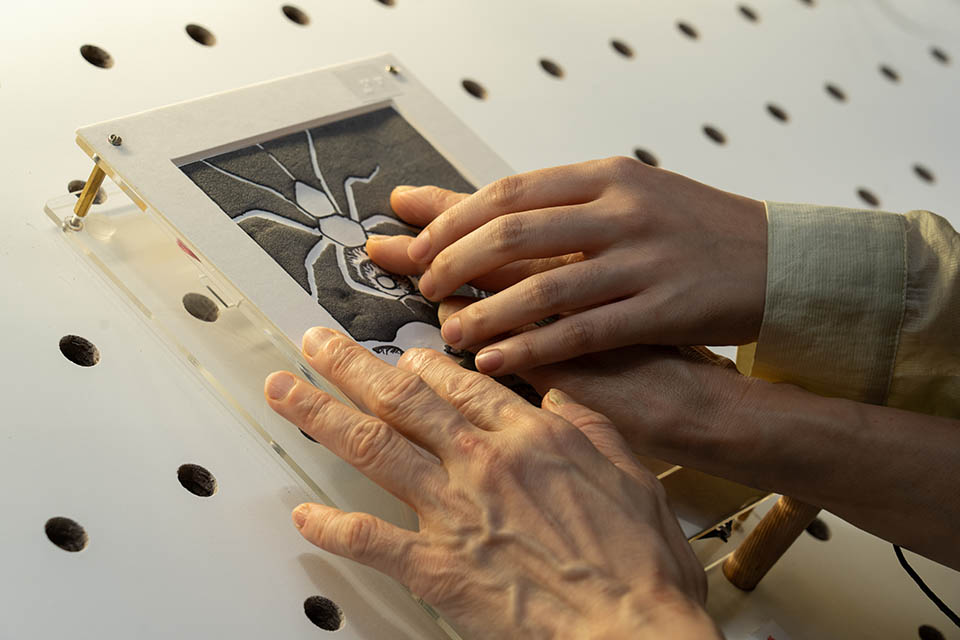

<a name="readme-top"></a>

<h1 align="center">🎵 共融藝術 ✕ 科技 學生工作坊 🎵</h1>
<p align="center"> 2023/24 Phase 1: Student Workshop </p>
<p align="center">👨‍🏫 ADAHK, Lazarus Chan, Fiona Lee </p>

## 🎨 工作坊內容簡介：
賽馬會科藝共融計劃（Jockey Club Project IDEA）由香港賽馬會慈善信託基金捐助、香港城市大學推行，旨在提升本地中學教師及學生對藝術科技的認識和能力，透過工作坊讓他們掌握如何應用數碼科技進行藝術創作，為傳統創作方式注入新元素，創造更多別樹一格的表現方式。同時，本計劃將透過分享和體驗活動提升學生對共融藝術的意識，啟發他們反思如何讓殘疾人士欣賞藝術及參與藝術活動，透過藝術科技建立共融的社會。

## DrawSound ｜電・紙樂器 – 用導電墨水將畫作變成電子樂器（觸感聲音互動畫作）  


由導師帶領同學學習不同 Software、Hardware的操作，配以觸感製作技術，將畫作變成觸感聲音互動裝置，從中學習到： 


1.	繪畫觸感互動介面：利用導電媒體（如Conductive ink）和熱感紙 (Swell Touch Paper)，創作出具有觸感和互動性的畫作、讓不同能力人士都能欣賞藝術作品；


2.	聲音的概念與特性（如 Timbre、Tone），運用現場錄音（Field Recording）、擬聲音效（Foley）等技巧，捕捉不同材質、物件的聲音；


3.	電子聲音創作平台 Ableton Learning Synths、Audacity和Arduino 軟硬件的運用 ；


4.	結合以上技巧，創作出獨一無二的視覺＋觸感＋聲音互動藝術作品，並探索利用導電媒體創作共融藝術的可能性，優秀作品亦有機會於年度展覽中展出。

<summary>📖 目錄</summary>
  <ol>
    <li> 
      <a href="#學習資料下載"> 學習資料下載</a>
    </li>
    <li><a href="#相關連結"> 相關連結</a></li>
    <li>
      <a href="#課前準備"> 課前準備</a>
    </li>
    <li><a href="#常見問題集"> 常見問題集</a></li>
  </ol>



## 學習資料下載：

<li>
<a href="https://github.com/JC-Project-IDEA/2023-24-PHASE-1-Student-Workshop/blob/main/JC-IDEA%20-%20Lesson%201.pdf"> 第1堂 - Drawing  </a>
</li>

<li>
<a href="https://github.com/JC-Project-IDEA/2023-24-PHASE-1-Student-Workshop/blob/main/JC-IDEA%20-%20Lesson%202.pdf"> 第2堂 - Arduino(I)  </a>
</li>

<li>
<a href="https://github.com/JC-Project-IDEA/2023-24-PHASE-1-Student-Workshop/blob/main/JC-IDEA%20-%20Lesson%203%20%26%204.pdf"> 第3-4堂 - Sound  </a>
</li>

<li>
<a href="https://github.com/JC-Project-IDEA/2023-24-PHASE-1-Student-Workshop/blob/main/JC-IDEA%20-%20Lesson%205.pdf"> 第5堂 - Arduino(II)  </a>
</li>

<li>
<a href="https://github.com/JC-Project-IDEA/2023-24-PHASE-1-Student-Workshop/blob/main/JC-IDEA_202324-Arduino.pdf"> 第6-7堂 - Arduino(III)  </a>
</li>

<li>
<a href= "https://github.com/JC-Project-IDEA/2023-24-PHASE-1-Student-Workshop/blob/main/Blink.txt"> Code Example - Blink</a>
</li>

<li>
<a href= "https://github.com/JC-Project-IDEA/2023-24-PHASE-1-Student-Workshop/blob/main/SimpleMp3Player.txt"> Code Example - SimpleMp3Player</a>
</li>

<li>
<a href= "https://playcanv.as/p/1sMAxJ0g/">DrawSound組裝步驟圖解</a>
</li>

## 相關連結
1. 音頻檔案轉換 (.m4a to .mp3) https://cloudconvert.com/m4a-to-mp3 or https://convertio.co/m4a-mp3/

2. Big Sound Bank https://bigsoundbank.com/

3. Free Sound https://freesound.org/

4. Internet Archive https://archive.org/details/opensource_audio

5. Royalty Free Ambient Sound https://pixabay.com/sound-effects/search/ambient/

6. Learningsynths(Ableton) https://learningsynths.ableton.com/en/playground

7. H4n manual https://zoomcorp.com/media/documents/H4n-manual.pdf


<p align="right">(<a href="#readme-top">back to top</a>)</p>


## 課前準備
我們需要Software、Hardware的結合，才能完成本課程的藝術創作。在開始創作前，我們需要下載軟件和準備好電子零件和工具。

### 下載軟件
1. 前往Arduino官網下載Arduino IDE (建議使用Legacy IDE (1.8.X) 1.8.19版本): https://www.arduino.cc/en/software 

   ❓什麼是Arduino：

    Arduino是一款便捷靈活、方便上手的開源電子原型平台。包含硬件（各種型號的Arduino板）和軟件（ArduinoIDE）。由一個歐洲開發團隊於2005年冬季開發。

2. 下一步，我們去Audacity官網下載最新版本的Audacity: https://www.audacityteam.org/download/

    ❓什麼是Audacity：

     Audacity是一款跨平台的音頻編輯軟件，用於錄音和編輯音訊，是自由、開放原始碼的軟體。這個程式可用於剪輯音樂、合併音樂、錄音、去除人聲、去除雜音等。
     
<p align="right">(<a href="#readme-top">back to top</a>)</p>


```sh
#include "SerialMP3Player.h"// 使用MP3板的編碼庫library

#include <CapacitiveSensor.h>// 使用可感應導電墨水的CAP SENSE編碼庫library

#define TX 10 //to MP3 board RX //定義ARDUINO TX到MP3 RX引腳連接
#define RX 11 //to MP3 board TX //定義ARDUINO RX到MP3 TX引腳連接

SerialMP3Player mp3(RX, TX);// 定義起動MP3相關的TX， RX

CapacitiveSensor sensor1 = CapacitiveSensor(2, 3);
CapacitiveSensor sensor2 = CapacitiveSensor(4, 5);
CapacitiveSensor sensor3 = CapacitiveSensor(6, 7);
//定義CAP SENSE導電感應引腳連接，兩者使用ARDUINO的DIGITAL引腳，並配合電阻達到感應運作 
//前者為SEND PIN,後者為RECIEVE PIN要連接到紙上


//設定：有電源起動時執行一次的程序
void setup() {
  Serial.begin(9600);     // 起動serial介面
  mp3.begin(9600);        // 開始MP3板的連接
  delay(500);             // 等待起動
  mp3.sendCommand(CMD_SEL_DEV, 0, 2);   //選取 sd-card
  delay(500);             // 等待起動
  mp3.setVol(50);// 設定音量
}


//迴圈: 處理器不停執行的程序
void loop() {

  long measurement1 =  sensor1.capacitiveSensor(10);//讀取SENSOR的數值
  long measurement2 =  sensor2.capacitiveSensor(10);//讀取SENSOR的數值
  long measurement3 =  sensor3.capacitiveSensor(10);//讀取SENSOR的數值

  Serial.print(measurement1);//SERIAL PRINT SENSOR的數值以方便MAPPING
  Serial.print("\t");
  Serial.print(measurement2);//SERIAL PRINT SENSOR的數值以方便MAPPING
  Serial.print("\t");
  Serial.print(measurement3);//SERIAL PRINT SENSOR的數值以方便MAPPING
  Serial.println("\t");

  if (measurement1 >= 60){//決定觸發起動歌曲的條件(值)
    mp3.play(1);     //歌曲於SD CARD內的次序
  }
  if (measurement2 >= 60){//決定觸發起動歌曲的條件(值)
    mp3.play(2);     //歌曲於SD CARD內的次序
  }
  if (measurement3 >= 60){//決定觸發起動歌曲的條件(值)
    mp3.play(3);     //歌曲於SD CARD內的次序
  }
  
  delay(50);//迴圈再執行的中間位
}
   ```

## 常見問題集


🤔️

1. 遇到問題時，我們可以在網上尋找解決辦法，Arduino官網的help center列舉了各種常見的問題：https://support.arduino.cc/hc/en-us ，你也可以在官網先觀看tutorials，對軟件、硬件進行更深入的學習。
2. 如果你是在運行Arduino IDE中遇到了問題，比如介面下方亮起紅色顯示error,你可以直接點擊“Copy error messages”，然後將error放到網上，就能找到解決辦法。有時候可能只是很小的問題，比如少打了一個標點符號或者打錯了一個字母、忘記安裝編碼庫等等。
3. 如果程式在燒錄後沒有顯示紅色的error，但是依然無法聽到聲音，那可以考慮是否是音頻本身或者電路連接的問題。打開Arduino IDE中的Serial Monitor (Tools --> Serial Monitor)，手指捏住電線，如果看到Serial Monitor中的數值發生變動（一般會大於400），說明有可能是音頻本身的問題，如果捏住電線，Serial Monitor中的數值沒有變化，則需要重新檢查電路連接。
4. 音頻問題：確保按照每一個步驟將聲音儲存到了micro sd卡裡。你可以在電腦裡先聽一遍自己的聲音，確保聲音能夠正常播放的，micro sd卡需要用力按進mp3板的卡槽裡，燒錄過程中如果見到mp3板的led燈閃爍，說明燒錄成功。
5. 電路連接問題：確保每條線路都依照手冊所示緊密連接，其中電阻和杜邦線都需要用力按進麵包板的孔裡才能通電；電線需要緊貼導電墨水，墨水的面積需要足夠大，而且確保3號RECIEVE PIN是連接到紙上的（2號是SEND PIN，不能連接到紙上）。硬件的問題多種多樣，需要耐心排除各種問題，有時候可以嘗試更換新的麵包板、杜邦線、電阻，也可以嘗試把線插進麵包板不同的空位裡。


<p align="right">(<a href="#readme-top">back to top</a>)</p>

